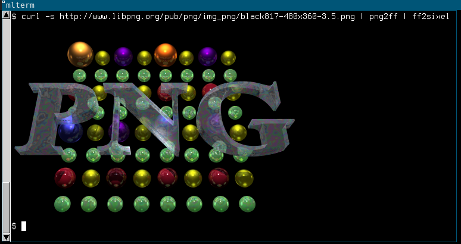

ff2sixel
========

ff2sixel is an utility to convert [farbfeld] images to [Sixels][manual].

Together with farbfeld utilities, it can be used to display images
over SSH.  Sixel-capable terminal is required, such as [mlterm]:

[kmiya's sixel] was used as a reference.  Its license is an informal
version of unlicense and does not demand acknowledgement, but it
is worth mentioning in any case.

To install just copy `ff2sixel` binary to your `$PATH`.

For convenience, `sx` script is provided, which makes it possible to
display a sequence of files with

    sx [file ...]

[farbfeld]: http://tools.suckless.org/farbfeld/
[manual]: http://vt100.net/docs/vt3xx-gp/chapter14.html
[mlterm]: http://mlterm.sourceforge.net/
[kmiya's sixel]: https://github.com/saitoha/sixel
